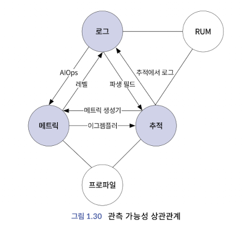

*본 문서는 도서 [모니터링의 새로운 미래 관측 가능성](https://www.google.co.kr/books/edition/%EB%AA%A8%EB%8B%88%ED%84%B0%EB%A7%81%EC%9D%98_%EC%83%88%EB%A1%9C%EC%9A%B4_%EB%AF%B8%EB%9E%98_%EA%B4%80%EC%B8%A1/vJf7EAAAQBAJ?hl=ko&gbpv=0)를 참고하여 작성되었습니다.* 
# 관측 가능성의 개념과 방향성
## 관측 가능성의 목표
* 내부 시스템에 대한 자세한 이해를 기반으로 미래에 발생활 이벤트를 예측하는 것 
* 클라우드 네이티브처럼 분산되고 복잡한 시스템에서 발생하는 이벤트에 대한 통찰력 그리고 태그, 로그 등을 결합해서 서비스(microservice)에 대한 콘텍스트 정보를 제공하는 것

## 관측 가능성의 3가지 구성 요소
### 1. Metric
> 일정 시간 동안 측정된 데이터를 집계하고 이를 수치화
#### *구글의 골든 시그널*
1. **지연**: 잠재적인 장애를 예측할 수 있는 유용한 신호로 서비스 요청 후 완료까지 걸리는 시간 측정
2. **에러**: 에러는 문제점과 내용을 직접적으로 출력함(명시적)
3. **트래픽**: 발생하는 요청의 양 -> 지연과 에러가 발생하더라도 중단 없이 적정 수준의 트래픽을 처리할 수 있는 시스템을 구축하는 것이 **클라우드 네이티브**의 사상
4. **포화**: 리스가 '현재 얼마나 채워졌는지'와 '얼마나 가득 채울 수 있는지'를 나타내는 것 
#### *메트릭 유형*
1. **카운터**: 모니터링하는 이벤트의 누적 개수 혹은 크기
2. **게이지**: 증가하거나 감소하는 임의의 값과 '현재 상태'를 표현하는 타입
3. **요약**: 응답의 크기와 대기시간을 추적하는데 사용하며 측정한 이벤트의 합계와 카운트 모두 제공
4. **히스토그램**: 시간 경과에 따른 추세와 데이터가 단일 범주에서 어떻게 분포되어 있는지 나타냄

### 2. Log
>애플리케이션 실행 시 생성되는 텍스트 라인으로 구조적인 JSON 형식이나 비구조적인 텍스트 형식으로 출력
#### 로그에 포함할 유용한 정보: 타임스탬프, field, source, level(category)
### 3. Trace
> 마이크로 서비스가 시스템을 경유하며 트랜잭션으ㄹ 처리하는 과정에서 발생하는 세부적인 정보
#### Trace의 구성 요소
Span: 전반적인 수행 시간 뿐만 아니라 각기 하위 동작의 시작과 소요 시간 정보
- 스팬 콘텍스트: 새로운 스팬을 생성하기 위해서 다른 스팬을 참조해야할 때 필요한 정보 제공
- 스팬 레퍼런스: 두 스팬 사이의 인과관계 
 
## Log, Metric, Trace의 상관관계

### Log & Trace
- Log에 Trace를 식별할 수 있는 Trace ID 추가 
### Trace & Metric
- Metric에서 Trace 정보를 수집하고 내부적으로 다양한 연산을 통해 Metric 값 생성
### Metric & Log
- Log에서 일정한 비율로 cardinality를 가지는 값은 Metric으로 변환