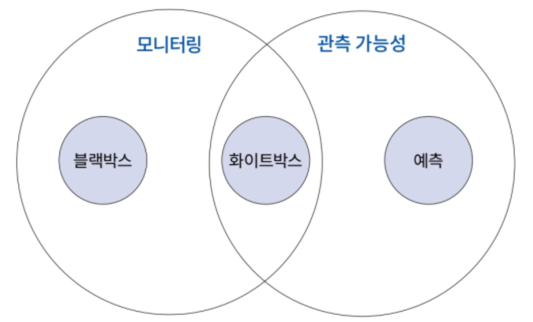

# Ch 1 : 관측 가능성의 개념과 방향성

## 관측 가능성
> '시스템에서 외부로 출력되는 값만을 사용해서, 시스템의 내부 상태를 이해하고 예측하는 것'

### 관측 가능성 vs. 모니터링
- 관측 가능성
  - 블랙박스 모니터링이 제공하는 정보는 상세하지 못하므로 상세한 디버깅 정보로 활용하기 어려움
  - 애플리케이션 내부의 상태를 디버깅할 수 있는 정보를 제공하므로 장애가 발생했을 경우 신속하고 수월하게 대응할 수 있음
  - 제공된 결과를 보고 이해하는 수준에 그치지 않고, 원하는 계측을 추가할 수 있음
    - 보다 자세하게 이해할 수 있을 뿐 아니라 향후 발생할 가능성이 높은 장애에 대한 예측이 가능함
  - 클라우드 네이티브처럼 분산되고 복잡한 시스템에서 발생하는 이벤트에 대한 통찰력 및 태그, 로그 등을 결합해서 서비스에 대한 문맥 정보를 제공하는 것이 목표
  - 주로 인프라와 애플리케이션의 데이터를 수집
- 모니터링
  - 전체적인 시스템 상태를 이해하는 데 적합
  - '모든 것을 수집하고 모니터링'하기보다는 가능한 샘플링을 사용해 적은 데이터를 수집하더라도 의미 있고 예측 가능한 결과를 도출해내는 것이 좋은 모니터링 방법
  - 핵심적인 애플리케이션과 시스템 메트릭에 집중

### 관측 가능성의 3가지 요소
- 메트릭
  - 일정 시간 동안 측정된 데이터를 집계하고 이를 수치화함
    - eg. 큐의 대기 메세지 개수, 사용 중인 CPU와 메모리의 크기, 서비스에서 초당 처리하는 개수 등
  - 전체적인 시스템의 상태를 보고하는 데 특히 유용함
  - 일반적으로 히스토그램 또는 게이지 차트를 사용해 시각적으로 표현
- 로그
  - 애플리케이션 실행 시 생성되는 텍스트 라인으로 구조적인 JSON 형식이나 비구조적인 텍스트 형식으로 출력됨
  - 애플리케이션 에러와 경고를 확인하고, 문제점에 대한 정확한 원인을 이해하기 위해서 필요
- 추적
  - 마이크로서비스가 시스템을 경유하며 트랜잭션을 처리하는 과정에서 발생하는 세부적인 정보를 보여줌
    - 트랜잭션이 시스템을 이동하는 경로, 트랜잭션을 처리하는 과정에서 발생하는 대기시간과 지연시간, 병목현상이나 에러를 일으키는 원인을 문맥과 로그, 태그 등의 메타데이터에 출력